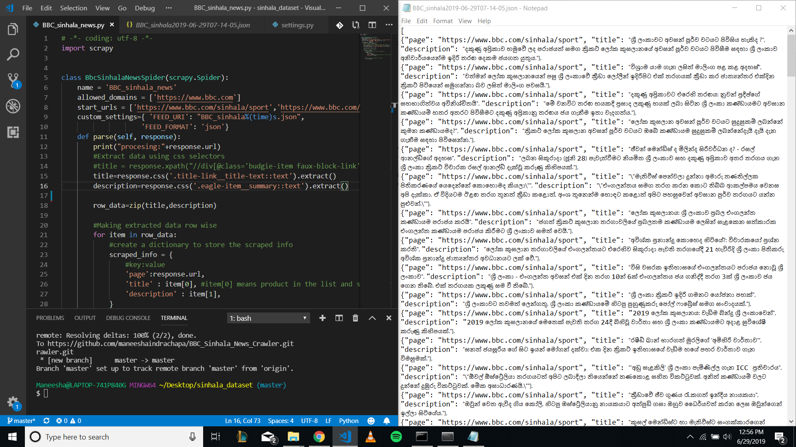

# BBC_Sinhala_News_Crawler
This is a Simple Web Crawler made using 'Scrapy' to Crawl News
 
## Steps
1. Install Scrapy using `conda install -c conda-forge scrapy` or `pip install scrapy`
2. Open Anaconda Terminal and type `scrapy shell` and make sure Scrapy is properly installed
3. Create a new Scrapy project using `scrapy startproject <project_name>` command in Anaconda Terminal
4. Create a Spider using `scrapy genspider <spider_name> <URL_for_data_crawling>`
5. then go to the proect folder and in `settings.py` file add `FEED_EXPORT_ENCODING = 'utf-8'` command to get data in UTF-8
6. then go to the spider you created and add `allowed_domains` variable to be the main domain and `start_urls` for the web pages you need to crawl
7. finally run `scrapy crawl <spider_name>` to crawl data

## Output

